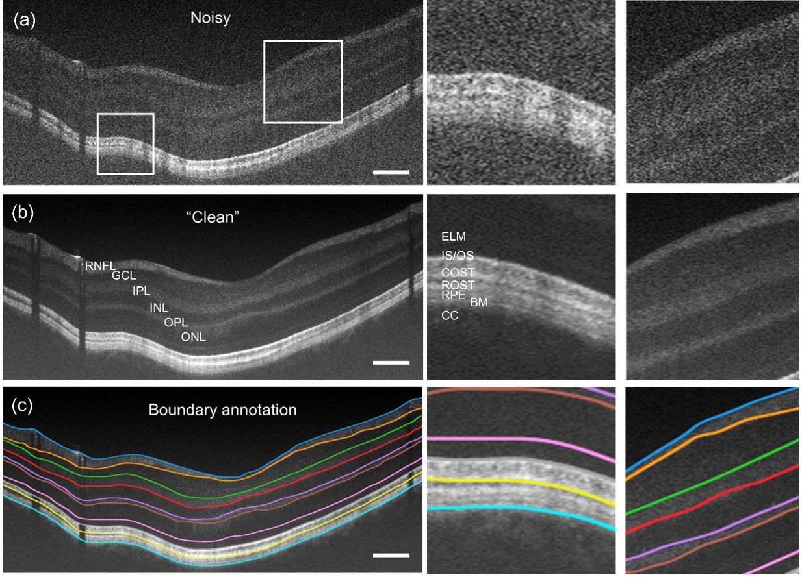

# Simultaneous Noise Reduction and Layer Segmentation for Visible Light Optical Coherence Tomography in Human Retina

## VIS-OCT dataset with noisy-clean pairs and retinal boundary delineation

This paper presents the first VIS-OCT retina image dataset for further machine-learning research. The data include retinal B-scans obtained on our 2nd Gen dual-channel VIS-OCT system for 12 subjects, all displayed normal-appearing VIS-OCT images with varying image quality. The provided dataset includes noisy-clean image pairs, wherein the clean image is obtained by averaging 16 or 32 B-scans at the same position of the retina. It also includes 10 manually delineated retinal boundaries, each of which is individually reviewed and edited. The dataset consists of 105 B-scans with a size of 512×512 in diverse positions of the retina.

## DenoiSegOCT
The code is modified and extended from [DenoiSeg](https://arxiv.org/abs/2005.02987).  
[VIS-OCT system](https://www.biorxiv.org/content/10.1101/2022.10.05.511048v1)
